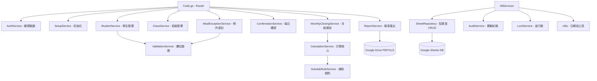

# 開發規範與系統詳細設計說明書 (AGENTS.md)

本文件定義「學校午餐停餐、用餐統計與補助申請管理系統」的專案規範、詳細設計與後續開發階段的工作清單。

🔍 **治理與驗證參考**：
* [系統驗證目錄與證據範本](docs/verification/README.md)
* [Phase 5 財務精度與月結治理驗證報告](docs/verification/phase_5_verification_report.md)
* [系統部署與維運手冊目錄](docs/deployment/README.md)

---

## 1. 專案目標

開發一套具備高安全性、優良效能、精緻前端 UI 且專門服務學校午餐管理流程的 Google Apps Script (GAS) 網頁應用程式。
* **行政友善**：採「預設用餐，登記例外」原則，減少導師填報負擔。
* **資料完整與稽核**：每次月結鎖定資料，所有異動均有 `AuditLogs` 紀錄，資料庫變更追蹤版本 `calculation_version`。
* **法規與審計符合**：自動依照身分與補助規則計算公所及縣府補助，產出標準 A4 列印格式的核章報表並歸檔至 Google Drive。

---

## 2. 技術架構

* **後端環境**：Google Apps Script (V8 引擎)。
* **資料儲存**：Google Sheets 作為關聯式資料庫。
* **使用者驗證**：利用 `Session.getActiveUser().getEmail()` 取得登入者 Email，對照 `Users` 工作表進行角色授權。
* **快取與並行**：使用 `CacheService` 提升常用設定與權限之讀取速度；寫入關鍵資料時使用 `LockService` 避免並行寫入衝突。
* **檔案儲存**：產出之報表 PDF 及試算表存入 Google Drive 指定 Folder。
* **前端介面**：使用 HTML Service 構建 Single Page Application (SPA)，基於 Vanilla CSS 提供現代化、具微動畫且支援響應式 (手機/平板/電腦) 的藍白色系 UI。前端不可直接對接試算表，必須經由 `google.script.run` 呼叫後端 API。

---

## 3. 資料表規格 (Google Sheets 資料字典)

試算表將做為系統資料庫，以下為各工作表（Sheet）欄位名稱、資料型態、索引與約束說明。

### 3.1 系統設定 (SystemConfig)
* 用途：儲存全系統全域變數與開關。
* 欄位：
  | 欄位名稱 | 資料型態 | 主鍵/索引 | 允許空值 | 說明 |
  | :--- | :--- | :--- | :--- | :--- |
  | `config_key` | STRING | PK | NO | 設定鍵（如 `SCHOOL_NAME`） |
  | `config_value` | STRING | - | YES | 設定值 |
  | `description` | STRING | - | YES | 設定描述說明 |
  | `updated_at` | DATETIME | - | NO | 最後更新時間 (ISO 8601, YYYY-MM-DD HH:mm:ss) |
  | `updated_by` | STRING | - | NO | 更新人員 Email |

* 預設必須包含的 Key：
  - `SCHOOL_NAME` (學校名稱)
  - `SCHOOL_CODE` (學校代碼)
  - `SCHOOL_YEAR` (當前學年度，如 `115`)
  - `SEMESTER` (學期，如 `1` 或 `2`)
  - `TIMEZONE` (預設為 `Asia/Taipei`)
  - `DEFAULT_MEAL_PRICE` (預設每餐金額，如 `60`)
  - `DAILY_CONFIRM_DEADLINE` (每日登記截止時間，如 `09:00`)
  - `REPORT_FOLDER_ID` (Drive 報表儲存根資料夾 ID)
  - `CURRENT_MONTH` (當前處理月份，如 `2026-09`)
  - `ALLOW_RETROACTIVE_EDIT` (是否允許補登記，`TRUE`/`FALSE`)
  - `RETROACTIVE_EDIT_DAYS` (允許補登記天數，整數)
  - `ROUNDING_RULE` (四捨五入規則，`DAILY_ROUND` 為每日/每身分計算後四捨五入，`MONTHLY_ROUND` 為月底總額乘以比例/金額後四捨五入)
  - `ROUNDING_MODE` (金額四捨五入模式：`HALF_UP` 四捨五入, `FLOOR` 無條件捨去, `CEILING` 無條件進位)
  - `ROUNDING_SCALE` (金額小數點保留位數，整數：`0`, `1`, `2`)
  - `ALLOW_SUBSIDY_OVER_MEAL_PRICE` (是否允許補助總額超過餐費：`TRUE`/`FALSE`)
  - `MIXED_RULE_CALCULATION_ORDER` (百分比與固定金額補助混用時之計算順序：`percentage_first` 或 `fixed_first`)
  - `ENABLE_DIETARY_STATS` (是否啟用葷/素食、乳品/豆漿等餐別統計，`TRUE`/`FALSE`)
  - `DIETARY_TYPES` (膳食分類統計項目，逗號分隔，如 `葷食,素食,乳品,豆漿`)
  - `INCLUDED_CLASS_TYPES` (納入統計的班級類型，逗號分隔，如 `regular,kindergarten,staff`)
  - `REOPEN_CONFIRM_ROLE` (允許退回/重新開放導師確認的角色，如 `system_admin,lunch_admin`)
  - `REPORT_TEMPLATE_TOWNSHIP_ID` (公所補助申請表之 Doc/HTML 範本 ID)
  - `REPORT_TEMPLATE_COUNTY_ID` (縣府補助申請表之 Doc/HTML 範本 ID)
  - `STUDENT_UNIQUE_KEY_MODE` (學生唯一性判定欄位模式：`SCHOOL_YEAR_AND_STUDENT_NUMBER` 或 `STUDENT_NUMBER_ONLY` 或 `CUSTOM_EXTERNAL_ID`)
  - `ENVIRONMENT` (系統執行環境：`DEVELOPMENT`, `TEST`, `PRODUCTION`)
  - `TEST_SPREADSHEET_ID` (自動測試專用的 Google 試算表 ID)


### 3.2 使用者 (Users)
* 用途：管理系統帳號與權限。
* 欄位：
  | 欄位名稱 | 資料型態 | 主鍵/索引 | 允許空值 | 說明 |
  | :--- | :--- | :--- | :--- | :--- |
  | `user_id` | STRING | PK (UUID) | NO | 使用者識別碼 |
  | `email` | STRING | UNIQUE INDEX| NO | 使用者 Google 帳號 Email |
  | `name` | STRING | - | NO | 使用者姓名 |
  | `role` | STRING | - | NO | 角色：`system_admin`, `lunch_admin`, `class_teacher`, `accountant`, `viewer` |
  | `class_id` | STRING | INDEX | YES | 當角色為 `class_teacher` 時，所屬的 `class_id`；其餘角色為空 |
  | `enabled` | BOOLEAN | - | NO | 帳號是否啟用 (`TRUE`/`FALSE`) |
  | `created_at` | DATETIME | - | NO | 建立時間 |
  | `updated_at` | DATETIME | - | NO | 更新時間 |

### 3.3 班級 (Classes)
* 用途：定義學校班級設定與導師綁定。
* 欄位：
  | 欄位名稱 | 資料型態 | 主鍵/索引 | 允許空值 | 說明 |
  | :--- | :--- | :--- | :--- | :--- |
  | `class_id` | STRING | PK (UUID) | NO | 班級識別碼 |
  | `school_year` | INT | INDEX | NO | 學年度，如 `115` |
  | `grade` | INT | - | NO | 年級，如 `1`, `2`, `3` |
  | `class_name` | STRING | - | NO | 班級名稱，如 `一班` |
  | `class_code` | STRING | UNIQUE | NO | 班級代碼 (如 `G1C1`) |
  | `teacher_name` | STRING | - | NO | 導師姓名 |
  | `teacher_email` | STRING | INDEX | NO | 導師 Email |
  | `class_type` | STRING | - | NO | 班級類型：`regular` (普通班), `kindergarten` (幼兒園), `staff` (教職員), `affiliated` (附設班) |
  | `display_order` | INT | - | NO | 前端顯示順序 |
  | `enabled` | BOOLEAN | - | NO | 是否啟用 (`TRUE`/`FALSE`) |
  | `created_at` | DATETIME | - | NO | 建立時間 |
  | `created_by` | STRING | - | NO | 建立者 Email |
  | `updated_at` | DATETIME | - | NO | 更新時間 |
  | `updated_by` | STRING | - | NO | 更新者 Email |


### 3.4 學生名冊 (Students)
* 用途：記錄所有學生基本資料、所屬班級、供餐狀態及目前補助身分快取。
* 欄位：
  | 欄位名稱 | 資料型態 | 主鍵/索引 | 允許空值 | 說明 |
  | :--- | :--- | :--- | :--- | :--- |
  | `student_id` | STRING | PK (UUID) | NO | 學生識別碼 |
  | `student_number`| STRING | UNIQUE | YES | 學號 |
  | `school_year` | INT | INDEX | NO | 學年度 |
  | `class_id` | STRING | INDEX | NO | 班級 ID |
  | `seat_number` | INT | - | NO | 座號 |
  | `student_name` | STRING | - | NO | 學生姓名 (個資去識別化原則：後端存完整，前端及日誌適當遮蔽如「陳*明」) |
  | `subsidy_category_id` | STRING | INDEX | NO | 補助身分類別 ID (快取目前最新身分，歷史計算應查詢歷程表) |
  | `dietary_type` | STRING | - | YES | 膳食類別 (如 `葷食`, `素食`, `乳品`, `豆漿` 等，由 `SystemConfig.DIETARY_TYPES` 設定) |
  | `meal_status` | STRING | - | NO | 供餐狀態：`normal` (正常), `suspended` (長期停餐), `transferred` (轉出), `graduated` (畢業) |
  | `start_date` | DATE | - | NO | 入學/轉入開始供餐日期 (YYYY-MM-DD) |
  | `end_date` | DATE | - | YES | 轉出/畢業停止供餐日期 (YYYY-MM-DD) |
  | `enabled` | BOOLEAN | - | NO | 檔案是否啟用 (`TRUE`/`FALSE`) |
  | `note` | STRING | - | YES | 備註說明 |
  | `created_at` | DATETIME | - | NO | 建立時間 |
  | `created_by` | STRING | - | NO | 建立者 Email |
  | `updated_at` | DATETIME | - | NO | 更新時間 |
  | `updated_by` | STRING | - | NO | 更新者 Email |


### 3.5 學生班級歷程 (StudentClassHistory)
* 用途：記錄學生所屬班級變更歷程，支援月中轉班之歷史用餐與補助對照。
* 欄位：
  | 欄位名稱 | 資料型態 | 主鍵/索引 | 允許空值 | 說明 |
  | :--- | :--- | :--- | :--- | :--- |
  | `history_id` | STRING | PK (UUID) | NO | 歷程識別碼 |
  | `student_id` | STRING | INDEX_1 | NO | 學生 ID |
  | `class_id` | STRING | INDEX_2 | NO | 班級 ID |
  | `effective_start_date` | DATE | - | NO | 生效開始日期 (YYYY-MM-DD) |
  | `effective_end_date` | DATE | - | YES | 生效結束日期 (YYYY-MM-DD)，若為空表示目前持續有效 |
  | `change_reason` | STRING | - | YES | 變更原因 |
  | `enabled` | BOOLEAN | - | NO | 是否啟用 (`TRUE`/`FALSE`) |
  | `created_by` | STRING | - | NO | 建立者 Email |
  | `created_at` | DATETIME | - | NO | 建立時間 |
  | `updated_by` | STRING | - | NO | 更新者 Email |
  | `updated_at` | DATETIME | - | NO | 更新時間 |

* 規則：
  1. 同一學生的班級有效日期區間不可重疊。
  2. 每日餐數與補助計算時，必須查詢當日有效的班級。
  3. `Students.class_id` 僅作為目前最新班級的快取，不可作為歷史計算唯一依據。
  4. 轉班時，必須將原班級歷程關閉（填入結束日期）並新增一筆新歷程。

### 3.6 學生補助身分歷程 (StudentSubsidyHistory)
* 用途：記錄學生補助身分的歷史變更，處理月中身分變更。
* 欄位：
  | 欄位名稱 | 資料型態 | 主鍵/索引 | 允許空值 | 說明 |
  | :--- | :--- | :--- | :--- | :--- |
  | `history_id` | STRING | PK (UUID) | NO | 歷程識別碼 |
  | `student_id` | STRING | INDEX_1 | NO | 學生 ID |
  | `subsidy_category_id` | STRING | INDEX_2 | NO | 補助身分類別 ID |
  | `effective_start_date` | DATE | - | NO | 生效開始日期 (YYYY-MM-DD) |
  | `effective_end_date` | DATE | - | YES | 生效結束日期 (YYYY-MM-DD)，若為空表示目前持續有效 |
  | `change_reason` | STRING | - | YES | 變更原因 |
  | `source_document_no` | STRING | - | YES | 佐證公文文號/申請單號 |
  | `enabled` | BOOLEAN | - | NO | 是否啟用 (`TRUE`/`FALSE`) |
  | `created_by` | STRING | - | NO | 建立者 Email |
  | `created_at` | DATETIME | - | NO | 建立時間 |
  | `updated_by` | STRING | - | NO | 更新者 Email |
  | `updated_at` | DATETIME | - | NO | 更新時間 |

* 規則：
  1. 同一學生的有效身分日期區間不可重疊（`effective_start_date` 至 `effective_end_date`）。
  2. 每日餐數計算時，必須查詢當日有效的補助身分。
  3. `Students.subsidy_category_id` 僅作為目前最新身分的快取，不可作為歷史計算唯一依據。
  4. 修改學生補助身分時，不可直接覆蓋舊資料，必須將原歷程關閉（填入結束日期）並新增一筆新歷程。
  5. 月結重新計算時，必須查表以還原用餐當日實際補助身分。
  6. 若某用餐日找不到學生的有效補助身分，列為計算異常，不得直接套用一般生。


### 3.7 補助身分類別 (SubsidyCategories)
* 用途：維護補助身分清單（可由管理員擴充或修改）。
* 欄位：
  | 欄位名稱 | 資料型態 | 主鍵/索引 | 允許空值 | 說明 |
  | :--- | :--- | :--- | :--- | :--- |
  | `subsidy_category_id`| STRING| PK | NO | 身分代碼，如 `GENERAL`, `LOW_INCOME` |
  | `category_name` | STRING | - | NO | 身分類別名稱，如 `一般學生`, `低收入戶` |
  | `description` | STRING | - | YES | 類別描述 |
  | `general_student_flag`| BOOLEAN | - | NO | 是否為一般學生 (`TRUE`/`FALSE`，影響公縣各 50% 規則判定) |
  | `enabled` | BOOLEAN | - | NO | 是否啟用 |
  | `display_order` | INT | - | NO | 顯示排序 |

### 3.8 補助規則 (SubsidyRules)
* 用途：定義各個補助身分對應的補助來源及比例/金額，不可寫死於程式中。
* 欄位：
  | 欄位名稱 | 資料型態 | 主鍵/索引 | 允許空值 | 說明 |
  | :--- | :--- | :--- | :--- | :--- |
  | `rule_id` | STRING | PK (UUID) | NO | 規則識別碼 |
  | `subsidy_category_id`| STRING| INDEX | NO | 補助身分類別 ID |
  | `funding_source` | STRING | - | NO | 補助來源：`township` (公所), `county` (縣府), `school` (學校), `self_pay` (自付), `other` |
  | `subsidy_rate` | DECIMAL | - | NO | 補助比例 (0.00 ~ 1.00，若為按比例計算) |
  | `subsidy_amount` | DECIMAL | - | NO | 每餐固定補助金額 (若為固定金額計算) |
  | `calculation_type` | STRING | - | NO | 計算類型：`percentage` (依餐費比例), `fixed_amount` (固定金額) |
  | `effective_start_date`| DATE | - | NO | 規則生效開始日 (YYYY-MM-DD) |
  | `effective_end_date`| DATE | - | NO | 規則生效結束日 (YYYY-MM-DD) |
  | `enabled` | BOOLEAN | - | NO | 是否啟用 |
  | `note` | STRING | - | YES | 備註 |

* 驗證與計算規則：
  1. 同一 `subsidy_category_id`、`funding_source` 的生效日期區間不可重疊。
  2. `percentage` 類型的 `subsidy_rate` 必須介於 0 到 1 之間。
  3. 同一身分類別同一日期的 `percentage` 規則總和原則上不得超過 1。
  4. 若總和低於 1，其餘差額必須有 `self_pay` 或其他資金來源的規則來補足。
  5. `fixed_amount` 不得為負數。
  6. 百分比補助加總金額不得超過當日餐費，除非 `SystemConfig.ALLOW_SUBSIDY_OVER_MEAL_PRICE` 設定明確允許（`TRUE`）。
  7. `percentage` 與 `fixed_amount` 混用時，必須依 `SystemConfig.MIXED_RULE_CALCULATION_ORDER` 定義之順序（`percentage_first` 或 `fixed_first`）進行計算。
  8. 找不到當日有效規則時，列為阻斷性錯誤，不得直接產生月結。


### 3.9 上課日設定 (SchoolDays)
* 用途：設定每一天的供餐狀態與單餐金額。
* 欄位：
  | 欄位名稱 | 資料型態 | 主鍵/索引 | 允許空值 | 說明 |
  | :--- | :--- | :--- | :--- | :--- |
  | `date` | DATE | PK | NO | 日期 (YYYY-MM-DD) |
  | `school_year` | INT | INDEX | NO | 學年度 |
  | `semester` | INT | - | NO | 學期 |
  | `is_meal_day` | BOOLEAN | - | NO | 當天是否供餐 (`TRUE`/`FALSE`) |
  | `meal_price` | DECIMAL | - | NO | 當日單餐金額 (預設讀取 SystemConfig 的 `DEFAULT_MEAL_PRICE`) |
  | `day_type` | STRING | - | NO | 日期類型：`regular` (上課日), `holiday` (例假日), `make_up_day` (補課補餐日), `school_event` (學校活動無餐), `no_meal` (不供餐), `other` |
  | `description` | STRING | - | YES | 說明 (如：颱風假、運動會補假) |
  | `locked` | BOOLEAN | - | NO | 是否已隨月結鎖定 (`TRUE`/`FALSE`) |
  | `updated_at` | DATETIME | - | NO | 最後修改時間 |

### 3.10 每日未用餐紀錄 (MealExceptions)
* 用途：登記每日學生未用餐之例外狀況（停餐紀錄）。
* 欄位：
  | 欄位名稱 | 資料型態 | 主鍵/索引 | 允許空值 | 說明 |
  | :--- | :--- | :--- | :--- | :--- |
  | `exception_id` | STRING | PK (UUID) | NO | 例外紀錄識別碼 |
  | `date` | DATE | INDEX_1 | NO | 未用餐日期 (YYYY-MM-DD) |
  | `student_id` | STRING | INDEX_2 | NO | 學生 ID |
  | `class_id` | STRING | INDEX_3 | NO | 班級 ID |
  | `exception_type` | STRING | - | NO | 未用餐原因類型：`leave` (請假), `meal_suspension` (長期停餐), `official_leave` (公假), `activity` (活動未用餐), `transferred` (已轉出), `temporary_no_meal` (臨時不供餐), `other` |
  | `reason` | STRING | - | YES | 詳細原因/備註 |
  | `meal_count` | INT | - | NO | 扣除餐數，預設為 1 |
  | `status` | STRING | - | NO | 狀態：`active` (有效), `cancelled` (已取消) |
  | `created_by` | STRING | - | NO | 建立者 Email |
  | `created_at` | DATETIME | - | NO | 建立時間 |
  | `updated_by` | STRING | - | NO | 更新者 Email |
  | `updated_at` | DATETIME | - | NO | 更新時間 |

* 約束：同一 `student_id` 在同一 `date` 僅能存有一筆 `status` 為 `active` 的紀錄。

### 3.11 班級每日確認 (DailyClassConfirmations)
* 用途：記錄導師每日確認班級停餐與否的狀態。
* 欄位：
  | 欄位名稱 | 資料型態 | 主鍵/索引 | 允許空值 | 說明 |
  | :--- | :--- | :--- | :--- | :--- |
  | `confirmation_id` | STRING | PK (UUID) | NO | 確認識別碼 |
  | `date` | DATE | INDEX_1 | NO | 日期 (YYYY-MM-DD) |
  | `class_id` | STRING | INDEX_2 | NO | 班級 ID |
  | `expected_student_count`| INT| - | NO | 班級當日合規應用餐人數 (含例外) |
  | `exception_count` | INT | - | NO | 當日登記例外未用餐人數 |
  | `actual_meal_count` | INT | - | NO | 當日實際用餐人數 |
  | `confirm_status` | STRING | - | NO | 確認狀態：`draft` (暫存), `confirmed` (已確認), `reopened` (退回重開), `locked` (月結鎖定) |
  | `confirmed_by` | STRING | - | YES | 確認者 Email |
  | `confirmed_at` | DATETIME | - | YES | 確認時間 |
  | `reopened_by` | STRING | - | YES | 重新開放填寫者 Email |
  | `reopened_at` | DATETIME | - | YES | 重新開放時間 |
  | `reopen_reason` | STRING | - | YES | 重開原因 |

### 3.12 每日餐數統計 (DailyMealSummary)
* 用途：由系統自動批次計算並儲存的每日各班、各補助身分餐數與試算金額（提供報表與圖表加速讀取）。
* 欄位：
  | 欄位名稱 | 資料型態 | 主鍵/索引 | 允許空值 | 說明 |
  | :--- | :--- | :--- | :--- | :--- |
  | `summary_id` | STRING | PK (UUID) | NO | 統計識別碼 |
  | `calculation_run_id`| STRING| INDEX | NO | 對應的計算 Run ID |
  | `calculation_version`| INT | - | NO | 計算版本號 (每次重算遞增) |
  | `date` | DATE | INDEX_1 | NO | 日期 (YYYY-MM-DD) |
  | `class_id` | STRING | INDEX_2 | NO | 班級 ID |
  | `subsidy_category_id`| STRING| INDEX_3 | NO | 補助身分類別 ID |
  | `dietary_type` | STRING | - | NO | 膳食類別 (如 葷食, 素食) |
  | `roster_count` | INT | - | NO | 當日該班級與身分有效且在籍的學生總數 (roster_count = 在籍有效學生數，排除 inactive/轉出者) |
  | `inactive_count` | INT | - | NO | 當日排除的非在籍人數 |
  | `suspension_count`| INT | - | NO | 當日該身分長期停餐人數 |
  | `exception_count` | INT | - | NO | 當日該身分請假登記未用餐人數 |
  | `actual_meal_count`| INT | - | NO | 當日實際用餐數 (actual_meal_count = roster_count - suspension_count - exception_count) |
  | `meal_price` | DECIMAL | - | NO | 當日單餐金額 |
  | `gross_meal_amount`| DECIMAL | - | NO | 當日餐費總金額 |
  | `confirmation_status`| STRING| - | NO | 班級確認狀態 (incomplete / confirmed) |
  | `source_hash` | STRING | - | NO | 來源資料雜湊值 |
  | `calculation_status`| STRING | - | NO | 計算狀態 (completed / incomplete) |
  | `calculated_at` | DATETIME | - | NO | 計算執行時間 |
  | `calculated_by` | STRING | - | NO | 執行計算者 Email |
  | `is_current` | BOOLEAN | - | NO | 是否為最新當前版本 (TRUE / FALSE) |
  | `township_amount` | DECIMAL | - | NO | 公所補助試算金額 (本階段預設為 0) |
  | `county_amount` | DECIMAL | - | NO | 縣府補助試算金額 (本階段預設為 0) |
  | `school_amount` | DECIMAL | - | NO | 學校補助試算金額 (本階段預設為 0) |
  | `self_pay_amount` | DECIMAL | - | NO | 自付試算金額 (本階段預設為 0) |
  | `funding_calculation_status`| STRING | - | NO | 補助計算狀態 (本階段預設為 NOT_CALCULATED) |

### 3.13 月結統計 (MonthlyMealSummary)
* 用途：存檔每月份、各班、各補助身分的最終餐數與補助金額（月結時鎖定寫入）。
* 欄位：
  | 欄位名稱 | 資料型態 | 主鍵/索引 | 允許空值 | 說明 |
  | :--- | :--- | :--- | :--- | :--- |
  | `monthly_summary_id` | STRING | PK (UUID) | NO | 月結識別碼 |
  | `calculation_run_id`| STRING| INDEX | NO | 計算 Run ID |
  | `year_month` | STRING | INDEX_1 | NO | 年月格式 (YYYY-MM) |
  | `class_id` | STRING | INDEX_2 | NO | 班級 ID |
  | `subsidy_category_id`| STRING| INDEX_3 | NO | 補助身分類別 ID |
  | `dietary_type` | STRING | - | NO | 膳食類別 (如 葷食, 素食) |
  | `meal_day_count` | INT | - | NO | 當月總供餐天數 |
  | `roster_meal_count`| INT | - | NO | 應供餐總餐數 (roster_count 的月度加總) |
  | `suspension_count`| INT | - | NO | 長期停餐扣減餐數 |
  | `exception_count` | INT | - | NO | 請假未用餐扣減餐數 |
  | `actual_meal_count`| INT | - | NO | 當月總實際用餐數 (actual_meal_count = roster_meal_count - suspension_count - exception_count) |
  | `gross_meal_amount`| DECIMAL | - | NO | 當月總餐費金額 (gross) |
  | `funding_calculation_status`| STRING | - | NO | 補助分攤狀態 (本階段為 NOT_CALCULATED) |
  | `reconciliation_status`| STRING | - | NO | 對帳狀態 (incomplete / warning / reconciled) |
  | `source_hash` | STRING | - | NO | 來源資料雜湊 |
  | `calculation_version`| INT | - | NO | 計算版本號 |
  | `calculated_by` | STRING | - | NO | 執行人員 Email |
  | `calculated_at` | DATETIME | - | NO | 執行時間 |
  | `is_current` | BOOLEAN | - | NO | 是否當前最新 (TRUE / FALSE) |
  | `township_subsidy` | DECIMAL | - | NO | 公所補助金額 (預設 0) |
  | `county_subsidy` | DECIMAL | - | NO | 縣府補助金額 (預設 0) |
  | `school_subsidy` | DECIMAL | - | NO | 學校補助金額 (預設 0) |
  | `self_pay_amount` | DECIMAL | - | NO | 自付總金額 (預設 0) |
  | `total_amount` | DECIMAL | - | NO | 當月總計金額 |
  | `closing_status` | STRING | - | NO | 月結狀態：`draft` (草稿試算), `calculated` (計算完成) |
  | `closed_by` | STRING | - | YES | 執行月結者 (本階段為空) |
  | `closed_at` | DATETIME | - | YES | 月結時間 (本階段為空) |

### 3.13.1 每日用餐資格帳冊 (DailyMealLedger)
* 用途：逐生逐日用餐資格帳冊，計算與對帳的最細粒度稽核基礎。
* 欄位：
  - `ledger_id` (PK)
  - `calculation_run_id` (INDEX)
  - `calculation_version`
  - `date` (INDEX)
  - `student_id` (INDEX)
  - `student_number_snapshot`
  - `student_name_masked` (去識別化處理，如 陳○明)
  - `class_id`
  - `class_code_snapshot`
  - `subsidy_category_id`
  - `subsidy_category_snapshot`
  - `dietary_type`
  - `meal_day_flag`
  - `student_active_flag`
  - `class_history_valid_flag`
  - `subsidy_history_valid_flag`
  - `suspension_flag`
  - `suspension_id`
  - `manual_exception_flag`
  - `exception_id`
  - `exclusion_type` (none, not_meal_day, not_active, transferred, graduated, class_history_missing, subsidy_history_missing, long_term_suspension, manual_exception, duplicate_exception, invalid_data, other)
  - `exclusion_reason`
  - `eligible_meal_count` (0 或 1)
  - `meal_price_snapshot`
  - `gross_meal_amount`
  - `source_hash`
  - `calculation_status`
  - `created_at`

### 3.13.2 計算批次紀錄 (CalculationRuns)
* 用途：管理統計計算的批次、版號、運算狀態與 Hash 防護。
* 欄位：
  - `calculation_run_id` (PK)
  - `calculation_type` (daily, date_range, monthly_preview)
  - `scope_start_date`
  - `scope_end_date`
  - `target_month`
  - `calculation_version`
  - `status` (queued, running, completed, completed_with_warning, failed, superseded)
  - `source_hash`
  - `source_record_count`
  - `ledger_count`
  - `summary_count`
  - `issue_count`
  - `started_by`
  - `started_at`
  - `completed_at`
  - `failed_at`
  - `error_code`
  - `error_message`
  - `previous_run_id`
  - `superseded_by_run_id`
  - `is_current` (TRUE / FALSE)
  - `note`

### 3.13.3 計算異常追蹤表 (CalculationIssues)
* 用途：紀錄並管理阻斷或警告性的運算異常。
* 欄位：
  - `issue_id` (PK)
  - `calculation_run_id` (INDEX)
  - `date`
  - `class_id`
  - `student_id`
  - `issue_code` (DUPLICATE_SCHOOL_DAY, MISSING_CLASS_HISTORY, OVERLAPPING_CLASS_HISTORY, MISSING_SUBSIDY_HISTORY, OVERLAPPING_SUBSIDY_HISTORY, CLASS_NOT_CONFIRMED 等)
  - `severity` (warning, blocking)
  - `message`
  - `source_sheet`
  - `source_record_id`
  - `status` (open, resolved, ignored)
  - `resolution_note`
  - `resolved_by`
  - `resolved_at`
  - `created_at`

### 3.14 報表紀錄 (Reports)
* 用途：紀錄系統產生之 PDF 與試算表報表，支援版本追蹤。
* 欄位：
  | 欄位名稱 | 資料型態 | 主鍵/索引 | 允許空值 | 說明 |
  | :--- | :--- | :--- | :--- | :--- |
  | `report_id` | STRING | PK (UUID) | NO | 報表紀錄識別碼 |
  | `year_month` | STRING | INDEX_1 | NO | 報表年月 (YYYY-MM) |
  | `report_type` | STRING | - | NO | 報表類型 (如 `township_application` 等) |
  | `report_name` | STRING | - | NO | 報表顯示檔名 |
  | `file_id` | STRING | - | NO | Google Drive 檔案 ID |
  | `file_url` | STRING | - | NO | Google Drive 檔案 URL |
  | `generated_by` | STRING | - | NO | 產生者 Email |
  | `generated_at` | DATETIME | - | NO | 產生時間 |
  | `calculation_version`| INT | - | NO | 對應的計算版本號 |
  | `archived` | BOOLEAN | - | NO | 是否為舊版封存 (`TRUE`/`FALSE`) |

### 3.15 匯入批次記錄 (ImportBatches)
* 用途：保存學生名冊匯入之批次狀態，用作補償式交易 (Rollback) 與防重複提交。
* 欄位：
  | 欄位名稱 | 資料型態 | 主鍵/索引 | 允許空值 | 說明 |
  | :--- | :--- | :--- | :--- | :--- |
  | `import_batch_id` | STRING | PK (UUID) | NO | 匯入批次識別碼 |
  | `import_type` | STRING | - | NO | 匯入類型 (如 `student_import`) |
  | `original_filename`| STRING | - | YES | 原始檔案名稱或文字來源說明 |
  | `total_rows` | INT | - | NO | 匯入總資料列數 |
  | `create_count` | INT | - | NO | 新增資料筆數 |
  | `update_count` | INT | - | NO | 更新資料筆數 |
  | `skip_count` | INT | - | NO | 跳過資料筆數 |
  | `error_count` | INT | - | NO | 錯誤資料筆數 |
  | `status` | STRING | INDEX | NO | 批次狀態：`previewed`, `committing`, `completed`, `failed`, `rolled_back` |
  | `started_by` | STRING | - | NO | 執行人員 Email |
  | `started_at` | DATETIME | - | NO | 開始執行時間 |
  | `completed_at` | DATETIME | - | YES | 執行完成時間 |
  | `failed_at` | DATETIME | - | YES | 失敗時間 |
  | `error_message` | STRING | - | YES | 錯誤詳細訊息 |
  | `rollback_status` | STRING | - | YES | 回復狀態 (`none`, `rolling_back`, `rolled_back`, `failed`) |
  | `payload_hash` | STRING | UNIQUE | NO | 資料雜湊值 (防止重複提交) |

### 3.16 異動紀錄 (AuditLogs)
* 用途：稽核系統中所有敏感性操作與資料修改。
* 欄位：
  | 欄位名稱 | 資料型態 | 主鍵/索引 | 允許空值 | 說明 |
  | :--- | :--- | :--- | :--- | :--- |
  | `log_id` | STRING | PK (UUID) | NO | 日誌識別碼 |
  | `timestamp` | DATETIME | INDEX | NO | 紀錄時間 |
  | `user_email` | STRING | - | NO | 操作者 Email |
  | `action` | STRING | - | NO | 動作名稱 (如 `CREATE_STUDENT`, `CLOSE_MONTH`, `REOPEN_CONFIRM`) |
  | `module` | STRING | - | NO | 功能模組名稱 |
  | `record_id` | STRING | - | YES | 受影響的資料 PK 值 |
  | `before_data` | STRING (JSON)| - | YES | 修改前資料快照 (建立時為空) |
  | `after_data` | STRING (JSON)| - | YES | 修改後資料快照 (刪除時為空) |
  | `reason` | STRING | - | YES | 異動原因 (解鎖、退回等重要操作必填) |
  | `ip_or_session` | STRING | - | YES | 操作者 Session/IP 資訊 |
  | `calculation_version`| INT | - | YES | 觸發計算時的版本號 |


---

## 4. 角色與權限矩陣與身份驗證

### 4.1 權限矩陣表
所有 API 與後端 Service 均需進行角色權限檢驗（在後端利用 `AuthService` 進行實體檢查），不可單純依靠前端隱藏按鈕。

| 權限項目 | system_admin | lunch_admin | class_teacher | accountant | viewer |
| :--- | :---: | :---: | :---: | :---: | :---: |
| **系統初始化與全校設定** | **V** | - | - | - | - |
| **帳號權限管理** | **V** | - | - | - | - |
| **補助規則/上課日設定** | **V** | **V** | - | - | - |
| **學生名冊管理與匯入** | **V** | **V** | - | - | - |
| **登記自己班級每日停餐** | **V** | **V** | **V** (限定自己班) | - | - |
| **確認自己班級每日餐數** | **V** | **V** | **V** (限定自己班) | - | - |
| **強制解鎖/退回班級確認** | **V** | **V** | - | - | - |
| **查看全校班級完成狀況** | **V** | **V** | - | **V** | **V** |
| **執行月結作業** | **V** | **V** | - | - | - |
| **解除月結作業 (填寫原因)** | **V** | - | - | - | - |
| **產出與下載補助報表** | **V** | **V** | - | **V** | **V** |
| **查看系統稽核日誌** | **V** | **V** | - | **V** | - |

### 4.2 Web App 部署與登入身份診斷 (AuthDiagnostic)
本系統預設以以下參數進行 Google Apps Script 網頁應用程式部署：
* **執行身分 (`executeAs`)**：`USER_DEPLOYING` (部署應用程式的使用者)
* **存取權限 (`access`)**：`DOMAIN` (僅限學校/組織 Google Workspace 網域內的使用者)

#### 部署架構目的：
1. **網域安全**：僅允許學校 Workspace 網域登入，防止外部無關帳戶存取。
2. **權限收攏**：由部署帳號統一存取底層 Google Sheets 資料庫與 Google Drive 報表資料夾，一般導師與行政人員**不需要**取得資料庫試算表的共用權限，防止試算表遭人為直接修改或破壞。
3. **後端認證**：後端依登入者 Email 查詢 `Users` 表決定系統權限。

#### 登入診斷防護機制：
由於以 `USER_DEPLOYING` 執行，`Session.getActiveUser().getEmail()` 在一般情況下可順利取得同網域使用者的 Email。但在某些權限受限或未授權的瀏覽器環境中，Email 可能會回傳空字串。
1. **阻斷性警告**：若 `activeUserEmail` 為空字串，系統狀態頁面必須顯示「阻斷性錯誤」，禁止操作系統，並明確提示建議切換至 `USER_ACCESSING` 部署。
2. **安全防護**：診斷資訊中若包含敏感 Token，**絕對不得**顯示在前端畫面或寫入任何 Log。

### 4.3 AuthService 統一介面規範
後端安全機制必須統一由 `AuthService` 提供以下方法，嚴禁前端傳入 `role` 或 `class_id` 作為後端驗證之唯一依據：
* `getCurrentIdentity()`：獲取當前使用者的登入資訊（Email、系統內定 Role、姓名、所屬 ClassID、網域診斷等）。
* `requireAuthenticatedUser()`：強制要求使用者必須通過驗證（Email 不得為空），否則拋出未登入錯誤。
* `requireRole(role)`：強制要求使用者必須具備指定之單一角色。
* `requireAnyRole(roles)`：強制要求使用者必須具備清單中至少一種角色。
* `requireClassAccess(classId)`：驗證當前使用者是否有權存取該班級（若為 `class_teacher` 則必須匹配其所屬 `class_id`；若為 Admin 則通過）。
* `validateDomain(email)`：驗證 Email 網域是否符合系統限定之 Google Workspace 網域。
* `getAuthorizationDiagnostic()`：提供完整的權限與環境診斷物件（包含 `activeUserEmail`, `effectiveUserEmail`, `currentDomain`, `spreadsheetReadable`, `reportFolderWritable` 等，但不含 OAuth Token）。


---

## 5. 系統模組關係與呼叫流程

系統依功能分為多個模組，後端以 Service-Repository 模式設計。

### 5.1 模組關係圖 (Mermaid)



### 5.2 呼叫流程說明
1. **使用者點選操作**：前端 (SPA 頁面) 發起異動請求。
2. **路由轉發與驗證**：`Code.gs` 接收後，先呼叫 `AuthService` 驗證目前使用者的 Email 與 Role 是否具備操作權限。
3. **並行鎖定**：若涉及資料寫入，Service 會透過 `LockService` 獲取鎖（鎖定時間最大 10 秒）。
4. **資料驗證**：進入 `ValidationService` 驗證資料是否合法（如：是否重複停餐、是否已月結、學生是否處於在學狀態）。
5. **資料異動與日誌**：執行 `SheetRepository` 的寫入，同時呼叫 `AuditService` 將修改前後的 Snapshot 以 JSON 格式寫入 `AuditLogs` 工作表。
6. **回傳格式**：所有端點一律回傳 `{success: true, data: ...}` 或 `{success: false, error_code: '...', message: '...', details: '...'}`。

---

## 6. 核心計算邏輯

### 6.1 每日餐數計算邏輯

計算特定日期 $D$、班級 $C$ 中，屬於補助身分類別 $S$ 的學生的**實際用餐數**。

#### 定義與變數：
1. **當日有效名單人數** ($RosterCount_{D, C, S}$):
   當日日期 $D$，學生符合：
   * 學生所屬班級為 $C$
   * 學生補助身分為 $S$
   * 學生啟用狀態 `enabled` = `TRUE`
   * 學生供餐狀態 `meal_status` = `normal`
   * $D$ 介於學生的開始供餐日期與結束供餐日期之間：$start\_date \le D \le end\_date$ (若 $end\_date$ 為空，則視為 $\ge start\_date$ 即可)。

2. **當日有效未用餐人數** ($ExceptionCount_{D, C, S}$):
   當日日期 $D$，學生符合上述「當日有效名單」且：
   * 在 `MealExceptions` 中存有當日 $D$ 的有效紀錄（`status` = `active`）
   * 扣除餐數 $meal\_count$ (預設為 1)

3. **當日實際用餐數** ($ActualMealCount_{D, C, S}$):
   $$ActualMealCount_{D, C, S} = RosterCount_{D, C, S} - ExceptionCount_{D, C, S}$$

### 6.2 補助金額計算邏輯

月結統計時，針對特定月份 $M$、班級 $C$、補助身分類別 $S$，統計其整月餐費與各來源之補助。

#### 步驟 1：取得每日餐數與單餐餐費
對於月份 $M$ 內的所有供餐日 $D_i$ ($is\_meal\_day = TRUE$)：
* 取得當日實際餐數：$ActualMealCount_{D_i, C, S}$
* 取得當日餐費單價：$MealPrice_{D_i}$

#### 步驟 2：比對補助規則 (SubsidyRules)
讀取在日期 $D_i$ 生效的補助規則。若學生身分為 $S$，其補助來源 $F \in \{township, county, school, self\_pay\}$ 的規則如下：
* **計算類型：按比例** (`calculation_type` = `percentage`)
  $$Amount_{D_i, C, S, F} = ActualMealCount_{D_i, C, S} \times MealPrice_{D_i} \times SubsidyRate_{S, F}$$
* **計算類型：固定金額** (`calculation_type` = `fixed_amount`)
  $$Amount_{D_i, C, S, F} = ActualMealCount_{D_i, C, S} \times SubsidyAmount_{S, F}$$

#### 步驟 3：小數點與四捨五入處理
依據 `SystemConfig.ROUNDING_RULE` 的設定值進行計算：

1. **逐餐/逐日四捨五入** (`ROUNDING_RULE` = `DAILY_ROUND`)：
   每日、每班、每身分類別計算各項補助來源金額並進行四捨五入：
   $$DailyAmountRound_{D_i, C, S, F} = \text{Round}(Amount_{D_i, C, S, F})$$
   當月總額 $TotalAmount_{M, C, S, F}$ 為每日四捨五入金額之累加：
   $$TotalAmount_{M, C, S, F} = \sum_{D_i \in M} DailyAmountRound_{D_i, C, S, F}$$

2. **月底總額四捨五入** (`ROUNDING_RULE` = `MONTHLY_ROUND`)：
   累加整月每日未稅金額（不進行逐日四捨五入），並於月底計算各項補助總額時再進行四捨五入：
   $$TotalAmountRaw_{M, C, S, F} = \sum_{D_i \in M} Amount_{D_i, C, S, F}$$
   $$TotalAmount_{M, C, S, F} = \text{Round}(TotalAmountRaw_{M, C, S, F})$$

> [!IMPORTANT]
> 不論採用何種四捨五入規則，系統均會驗證「各班餐數與總餐費的加總」與「各補助來源加總金額等於總金額」的一致性。
> 當月中發生餐費調整或補助規則日期異動時，`CalculationService` 會自動依據 $D_i$ 對應的 `SchoolDays.meal_price` 與該日生效的 `SubsidyRules` 進行動態計算。

#### 步驟 4：進位模式與小數點位數處理
在 `applyRounding` 時，應根據 `SystemConfig` 的設定動態調整進位方式與小數保留位數：
* **進位模式 (`SystemConfig.ROUNDING_MODE`)**：
  - `HALF_UP`：四捨五入。
  - `FLOOR`：無條件捨去。
  - `CEILING`：無條件進位。
* **保留位數 (`SystemConfig.ROUNDING_SCALE`)**：
  - `0`：保留至個位數。
  - `1`：保留至小數點後第一位。
  - `2`：保留至小數點後第二位。

#### 步驟 5：統一金額運算介面
所有涉及金額與小數運算之處，均禁止在不同 Service、前端 HTML 或報表程式中自行呼叫 `Math.round` 或進行浮點數運算。必須統一由 `CalculationService` 提供以下標準方法：
* `calculateRawAmount(mealCount, price, rateOrAmount, type)`：計算未進位之原始金額。
* `applyRounding(rawAmount)`：依據 `ROUNDING_MODE` 與 `ROUNDING_SCALE` 進行數值進位處理。
* `calculateFundingAmounts(date, classId, subsidyCategoryId, mealCount)`：依當日有效補助規則，計算並進位各來源（公所、縣府、自付等）之補助金額。
* `validateFundingTotal(totalAmount, fundingAmountsMap)`：驗證各補助來源加總是否等於總餐費。
* `getApplicableSubsidyRules(date, subsidyCategoryId)`：獲取該身分於指定日期生效之補助規則清單。
* `getStudentSubsidyCategoryAtDate(date, studentId)`：查詢指定學生於指定日期在 `StudentSubsidyHistory` 中的有效補助身分。


---

## 7. 月結狀態機與鎖定機制

為了維護財務資料的嚴謹性，防止已申報之數據被篡改，系統實作「月結鎖定」與「解鎖」狀態機。

### 7.1 狀態轉移圖

```text
       [ 試算草稿 (Draft) ]
               │
               ▼ (執行計算並檢查缺漏)
     [ 計算完成 (Calculated) ] ◄──────────┐
               │                          │
               ▼ (鎖定月結並產生報表)       │ (系統管理員解除月結，
     [ 已封存鎖定 (Closed) ]               │  填寫原因，舊報表封存)
               │                          │
               └──────────────────────────┘
```

### 7.2 狀態說明與約束：
1. **Draft (試算草稿)**：每月預設狀態。此時導師仍可登記/修改當月任何日期的停餐，每日餐數可隨時重新計算。
2. **Calculated (計算完成)**：管理員執行「月結試算」無誤後，系統完成全月各日資料核對（檢查是否所有供餐日班級皆已確認）。
3. **Closed (已封存鎖定)**：管理員按下「鎖定月結」：
   * 當月所有 `MealExceptions` 紀錄之 `status` 被鎖定，不允許新增、修改或取消。
   * 當月所有 `DailyClassConfirmations` 鎖定，不可退回重開。
   * 將計算結果正式寫入 `MonthlyMealSummary`，鎖定補助金額。
   * 產出各項補助報表並存入 Google Drive，檔案狀態標示為 `archived` = `FALSE`。
4. **Reopened (解除鎖定重開)**：
   * **僅 `system_admin` 有權限操作**。
   * 必須於前端彈出對話框要求強制輸入「解除月結原因」。
   * 系統將變更狀態，並記錄於 `AuditLogs`。
   * 原已產生的 Google Drive 報表**不可刪除**，但其在 `Reports` 工作表中的 `archived` 欄位將被設為 `TRUE`，防止審計混淆。
   * 解鎖後，系統產生新的 `calculation_version`。重新月結鎖定時，將產出新版本的報表（如：`_V2.pdf`）。

---

## 8. 開發規範與準則

### 8.1 命名規則
* **後端檔案與變數**：
  - 檔案名稱：大駝峰 (駝峰命名，如 `StudentService.gs`, `SheetRepository.gs`)。
  - 變數與函式：小駝峰 (如 `getStudentById`, `activeUserEmail`)。
  - 資料庫欄位：底線命名 (Snake Case，如 `student_id`, `created_at`)，必須與 Google Sheets 欄位完全一致。
* **前端檔案**：
  - 網頁/視圖檔案：大駝峰 (如 `DailyMealEntry.html`, `StudentManagement.html`)。

### 8.2 日期與時區規則
* 系統內部統一採用 `Asia/Taipei` 時區。
* 資料庫中日期一律儲存為字串 `YYYY-MM-DD`（避免 Excel/Google Sheets 時區轉換產生 +-1 天的誤差）。
* 時間戳記一律使用 `YYYY-MM-DD HH:mm:ss` 格式字串。

### 8.3 效能防護（防止 GAS 執行逾時）
* 嚴禁在迴圈中呼叫 `Range.getValue()` 或 `Range.setValue()`。
* 所有資料查詢應一次讀取（`getValues()`），並在記憶體中利用 Map/Reduce 進行篩選與比對。
* 寫入資料時應整理成二維陣列後，一次性使用 `setValues()` 寫回。
* 讀取設定檔與使用者角色時，應優先使用 `CacheService` 進行快取（快取時間設為 20 分鐘，資料更新時主動清除快取）。

### 8.4 不可破壞項目
1. **不可任意更改工作表名稱**：如 `Students`, `MealExceptions` 等名稱為系統核心，不可變更。
2. **不可任意更改欄位名稱**：試算表首行之欄位名稱已被對照對應，不可任意修改或調整順序。
3. **不可刪除既有歷史資料**：所有刪除操作均應為邏輯刪除（如 `enabled` = `FALSE` 或 `status` = `cancelled`），以保留稽核軌跡。
4. **不可將補助比例寫死**：補助比例、計算方式必須從 `SubsidyRules` 中動態讀取。
5. **不可繞過後端權限檢查**：每次前端透過 `google.script.run` 呼叫後端 Service 時，後端必須第一時間以 `AuthService` 進行身份與權限驗證。

---

## 9. 測試與部署規範

* **測試要求**：
  - 每完成一個 Phase 的功能，必須撰寫對應的測試函數（置於 `scratch/testRunner.gs` 中），模擬多種異常情境。
  - 每次計算重新執行時，必須確保**冪等性**（即重複執行多次，資料庫結果不變，不會重複寫入統計列）。
* **修改回報格式**：
  每階段完成時，需詳細回報：
  1. 已完成項目 (與對應之功能)
  2. 修改或新增的檔案 (附 clickable links)
  3. 資料表異動 (欄位或預設資料變更)
  4. 測試方式 (模擬之情境與輸入)
  5. 測試結果 (輸出之數據與 Log)
  6. 尚未完成項目 (留待下階段)
  7. 下一階段建議

---

## 10. Phase 1 開發工作清單 (即將執行)

Phase 1 將聚焦於**初始化精靈與權限控制**：
1. **實作後端 `Config.gs`**：封裝對 `PropertiesService` 與 `SystemConfig` 的存取方法，並加入快取機制。
2. **實作後端 `SetupService.gs`**：
   - 建立全套 16 張工作表（包含 `StudentClassHistory` 與 `ImportBatches`），自動填入首行欄位標題。

   - 填入 `SystemConfig` 初始參數（學校名稱、預設餐費、截止時間、進位模式、小數保留位數等）。
   - 初始化預設的 `SubsidyCategories` (GENERAL, LOW_INCOME 等) 與對應的 `SubsidyRules`（範本草稿狀態，不直接啟用）。
   - 寫入最高管理員帳戶（讀取部署者 Email，寫入 `Users` 作為 `system_admin`）。
   - 提供**冪等性檢查**：若工作表已存在，則跳過建立，僅補足缺失的欄位或設定，不破壞現有資料；若有未知欄位則保留並提示警告。
3. **實作後端 `AuthService.gs`**：
   - 獲取當前使用者 Email，實作 `validateDomain`、`getCurrentIdentity` 與 `getAuthorizationDiagnostic` 等診斷。
   - 在 `Users` 工作表中比對帳號是否啟用且角色相符，對各個 API 端點進行後端權限阻擋。
4. **實作前端首頁與診斷骨架 (`Index.html`, `Styles.html`, `Scripts.html`, `SetupWizard.html`, `SystemStatus.html`, `AuthDiagnostic.html`)**：
   - 載入 SPA 主畫面與導覽列。
   - 實作網頁開啟時的「系統狀態檢查」及「登入診斷」（`AuthDiagnostic`）。
   - 若系統尚未初始化，引導至「初始化精靈」畫面（限管理員）。
   - 若使用者未在 `Users` 名單中，顯示 `LoginError.html` (權限不足提示)。
   - 若 `activeUserEmail` 為空字串，顯示阻斷性警告並提出切換 `USER_ACCESSING` 部署之建議。


---

## 11. 主要風險與待確認事項

1. **`Session.getActiveUser().getEmail()` 的限制**：
   * **風險**：在 Google Apps Script 中，若 Web App 部署為「執行身分：存取的使用者 (User accessing the web app)」，使用者首次進入網頁時會被要求授權。若使用者使用外部一般 Gmail 帳號（非學校 G Suite/Google Workspace 網域帳號），且試算表沒有分享給該使用者，可能會導致存取失敗。
   * **建議方案**：本系統預設學校教師皆擁有學校網域帳號，且試算表已與相關行政人員共用。部署時需特別提醒此權限設定。
2. **月底補助計算的四捨五入落差**：
   * **風險**：若先加總整月餐數再乘以補助比例，與每日計算金額再加總，可能會產生 1-2 元的四捨五入落差，這在學校主計/會計審計中非常敏感。
   * **建議方案**：本系統設計已於「6.2 補助金額計算邏輯」中規範，一律採**每日/每班/每身分計算金額後四捨五入至整數，再進行累加**。需與學校主計人員確認此做法是否符合該校會計室規範。
3. **多人同時送出登記/月結之並行衝突**：
   * **風險**：多位導師在早上 9:00 前同時送出確認，可能造成 Google Sheets 資料覆蓋或鎖定衝突。
   * **建議方案**：後端寫入 `MealExceptions` 與 `DailyClassConfirmations` 時，必須在 Service 中使用 `LockService.getScriptLock()`，確保單一時間僅有一筆寫入動作在進行，其餘請求排隊（超時設為 10 秒）。
